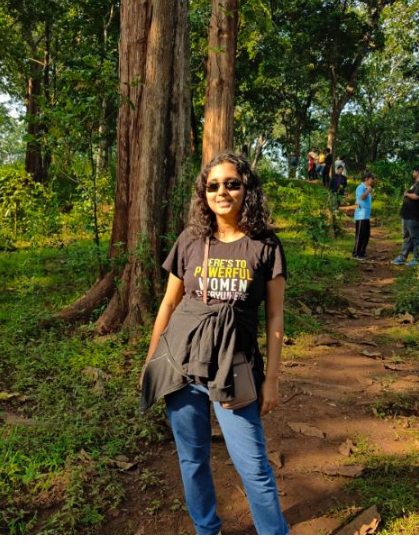

<!DOCTYPE html>
<html lang="en">
<head>
    <meta charset="UTF-8">
    <meta name="viewport" content="width=device-width, initial-scale=1.0">
    <title>Portfolio</title>
    <link
    href="https://cdn.jsdelivr.net/npm/remixicon@4.0.0/fonts/remixicon.css"
    rel="stylesheet"
/>
    
    
</head>
<body>
    

    

        

            <i class="ri-arrow-left-line"></i>
            

                
                
                
                
            

            

                <h1>Hello,</h1>
                
Greetings! I'm Prakruthi, a passionate and creative individual with a love for web development and design. 
			With a keen eye for detail and a dedication to crafting visually appealing and functional websites, I bring a unique blend of technical skills and artistic flair to every project. My journey in the world of coding began with HTML and CSS, and over time, I've delved into the realms of JavaScript and various web development frameworks. Beyond the lines of code, I am driven by a constant desire to learn and explore new technologies, ensuring that I stay at the forefront of the ever-evolving digital landscape. When I'm not immersed in coding, you can find me experimenting with design concepts, enjoying a good cup of coffee, or exploring the latest trends in the tech world. Let's connect and explore the endless possibilities of the web together!

                     When I'm not immersed in coding, you can find me experimenting with design concepts, enjoying a good cup of coffee, or exploring the latest trends in the tech world. Let's connect and explore the endless possibilities of the web together!

                <a href="r.html">Start</a>
            
            

        

    

    

        
        

                
    

    
</body>
</html>
